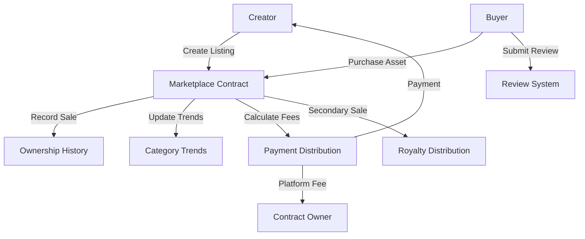

# Token Revert

A sophisticated token transaction reversal mechanism on the Stacks blockchain, providing enhanced security and control for digital asset transfers.

## Overview

Token Revert is an advanced smart contract built on the Stacks blockchain that enables:
- Emergency transaction cancellation
- Protection against unauthorized transfers
- Advanced token transfer controls
- Secure transaction tracking
- Detailed audit and recovery mechanisms

Key features:
- Transaction reversion capabilities
- Comprehensive security controls
- Detailed transaction logging
- Flexible authorization management
- Granular access control

## Architecture

The marketplace is built around a single core smart contract that handles all marketplace operations:



### Core Components:
1. **Listing Management**: Creation, updating, and removal of asset listings
2. **Purchase System**: Secure buying process with automatic fee distribution
3. **Ownership Tracking**: Historical record of asset ownership
4. **Review System**: Buyer feedback and rating mechanism
5. **Trend Analysis**: Purchase tracking by category and time period

## Contract Documentation

### Token Revert Smart Contract

The main contract (`token-revert.clar`) provides advanced transaction security and control mechanisms.

#### Key Features

- **Transaction Reversal**
  - Emergency transaction cancellation
  - Granular transaction blocking
  - Detailed transaction tracking

- **Security Controls**
  - Implement complex authorization rules
  - Prevent unauthorized token transfers
  - Create transaction whitelists and blacklists

- **Audit Mechanisms**
  - Comprehensive transaction logging
  - Detailed ownership and transfer records
  - Support for forensic analysis

#### Access Control
- Only authorized administrators can revert transactions
- Configurable role-based access control
- Multi-signature approval for critical operations
- Transparent and auditable governance model

## Getting Started

### Prerequisites
- Clarinet
- Stacks wallet
- STX tokens for transactions

### Basic Usage

1. **Initiating a Transaction Revert**
```clarity
(contract-call? .token-revert revert-transaction 
    tx-id       ;; Unique transaction identifier
    reason      ;; Reason for reversion
    u10         ;; Optional revert confirmation threshold
)
```

2. **Setting Transaction Authorization**
```clarity
(contract-call? .token-revert set-transaction-rules 
    sender      ;; Principal sender
    max-amount  ;; Maximum allowed transaction amount
    u5          ;; Number of required confirmations
)
```

3. **Logging a Suspicious Transaction**
```clarity
(contract-call? .token-revert log-suspicious-transaction 
    tx-id       ;; Transaction ID
    "Potential fraud detected" ;; Detailed description
)
```

## Function Reference

### Public Functions

#### Listing Management
```clarity
(create-listing (title (string-ascii 100)) 
                (description (string-utf8 500)) 
                (price uint) 
                (category (string-ascii 50))
                (preview-url (string-utf8 200))
                (full-asset-url (string-utf8 200))
                (royalty-percent uint))

(update-listing (listing-id uint) ...)
(remove-listing (listing-id uint))
```

#### Transaction Functions
```clarity
(purchase-asset (listing-id uint))
(resell-asset (listing-id uint) (new-price uint))
```

#### Review System
```clarity
(submit-review (listing-id uint) (score uint) (comment (string-utf8 300)))
```

### Read-Only Functions
```clarity
(get-listing (listing-id uint))
(has-purchased (listing-id uint) (user principal))
(get-review (listing-id uint) (reviewer principal))
(get-category-trend (category (string-ascii 50)) (month-year (string-ascii 7)))
(get-ownership-history (listing-id uint) (index uint))
```

## Development

### Testing
1. Install Clarinet
2. Clone the repository
3. Run tests:
```bash
clarinet test
```

### Local Development
1. Start Clarinet console:
```bash
clarinet console
```
2. Deploy contract:
```clarity
(contract-call? .trendcraft-marketplace ...)
```

## Security Considerations

### Limitations
- Transaction reversion is subject to confirmation thresholds
- Dispute resolution requires administrative consensus
- Real-time transaction tracking has block-level granularity

### Best Practices
- Maintain comprehensive admin access control
- Set conservative transaction rule parameters
- Implement multi-signature approval for critical reversals
- Regularly audit transaction logs
- Use granular permissions for different admin roles
- Establish clear governance protocols for transaction disputes